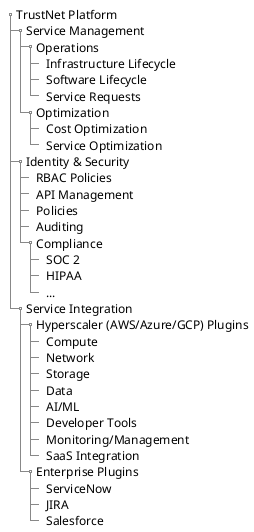
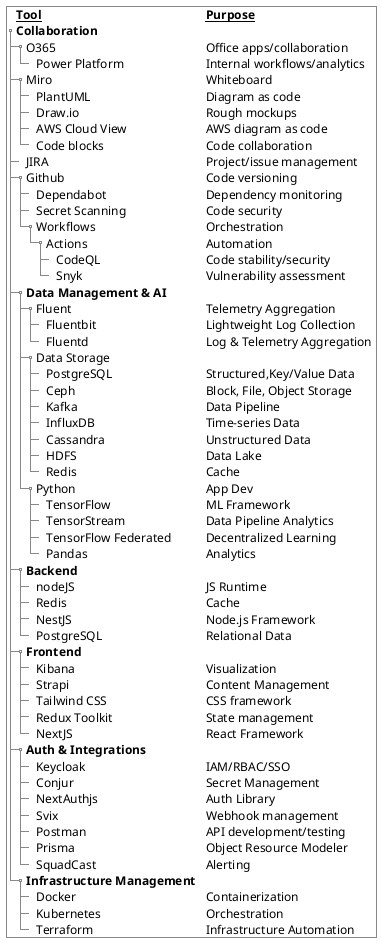
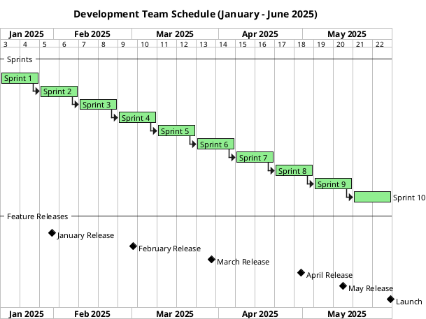
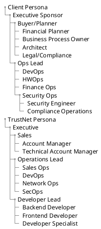
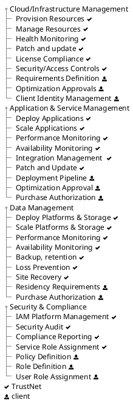

# TrustNet
Fictitious cloud ITSM platform concept, used for educational purposes
# Platform Charter

**NOTE:  This charter document is for process illustration only, and does not represent any real or planned platform.**

The TrustNet Platform Charter guides, but does not dictate TrustNet Platform principles, policies, and defaults.  Exceptions are allowed and noted in the appropriate platforms, documentation, and interfaces.  
## Platform Overview

The TrustNet Platform endeavors to be a service agnostic, compliant, API-driven, planet-scale interface for TrustNet Clients to seamlessly view, manage, and optimize data compute, network, and storage services, featuring highly detailed cost transparency and informed by the best practices of the Client's business sector.
### Product Breakdown Structure

The PBS inventories the function of the TrustNet Platform and informs the platform's representation in the graphical interfaces, documentation, and API.



## Platform Team Mission
The TrustNet Platform team is continually, consistently, and sustainably responsive to client needs, prioritizing user safety, satisfaction, and innovation.

### Platform Team Values
To be completed as a collaborative exercise

### Toolchain
The development toolchain documents but does not dictate tool use by the platform team.  Packages distributed with the TrustNet platform are documented in the daily software bill of materials. 


### Product Architecture
Notional Product architecture aligned around open source licensing.


### Development Deliverables
|                   Deliverable | Daily Build | Feature Release |
| ----------------------------: | ----------- | --------------- |
|                       Runbook | ✅           | ✅               |
|                    Data Model | ✅           | ✅               |
|                  Software BoM | ✅           | ✅               |
|              Unit Test Report | ✅           | ✅               |
|          Vulnerability Report | ✅           | ✅               |
| Product Requirements Document |             | ✅               |
|               Risk Assessment |             | ✅               |
|              Deployment Guide |             | ✅               |
|                 Release Notes |             | ✅               |
|                    UAT Report |             | ✅               |
|                 User Training |             | ❓               |
### Development Cycle


### Requirement Development
Requirements arrive from any source into the backlog aligned to [user persona](#user-persona) in "as a, so that" format.  PDM and Architecture break down and refine the requirements.  Once requirements are fully understood as needed into the ready backlog,
```plantuml
title requirement development process
left to right direction
database backlog
note right of backlog : 1. user story
database readybacklog as "ready\nbacklog"
note right of readybacklog : 1. user story\n2. value\n3. size\n4. priority\n5. mockup\n6. design\n7. risk
node devprocess as "Development\nProcess"

node refinement as "Refinement\nProcess"

()sales --> ()backlog
()presales --> ()backlog
()business -->()backlog
()engineering --> ()backlog 
()ops --> ()backlog
()design --> ()backlog
()research --> ()backlog
refinement --> pdm
()pdm --> refinement
refinement --> arch
arch --> refinement
backlog --> refinement
refinement --> readybacklog
readybacklog --> devprocess


```
## User Persona

***Client Persona*** critically inform RBAC decisions, and secondarily ensure that stakeholder concerns are addressed during the design and development process.  They can inform marketing exercises, as well as investment allocation.   Client persona should also carry to the field, where they can be used to ensure adequate coverage during the sales and support lifecycle.  

***TrustNet Persona*** are key tools in the prevention and elimination of technical debt.  They ensure that development intended for internal consumption is coherently and sustainably designed and prioritized.

All design and development should be:

* aligned to a key **goal**, **pain point**, or **feature** of at least one defined personage and one existing or planned [Service Offering](#service-offerings).

* assessed for the experience impact to other persona

Product management will define and maintain the following persona, as well as others to
 account for specific verticals or technologies.



### Development Practices
TBD as determined by business - agile, paired programming, test-led dev, daily standup, etc.
### Versioning Strategy
Semver, Calver, etc.
## Support Model
TrustNet platform releases are supported for 18 months from date of release, and receive weekly stability and security updates.  Updates are data-in-place, and any interruptions to production and management workflows are minimized and documented.

Extended Support releases are flagged and supported for the duration noted.  
## Responsibility Model
The following default Responsibility Model may be customized on a per client basis.


## Service Offerings
The TrustNet Platform Team builds and maintains broad SRE competencies in all of the listed cloud services.  Cost and Performance Optimization capabilities vary by provider and service.

```plantuml
folder "Hyperscaler Platforms" {
    folder "AWS" {

     json "<b><u>AWS Services" {
      "Compute":["EC2","Lightsail","Lambda","ECS","EKS","Fargate","Outposts","Batch","Elastic Beanstalk","Wavelength"],
      "Network":["VPC","Elastic Load Balancer","Route 53","Direct Connect","Cloudfront","Transit Gateway"],
      "Storage":["S3","EBS","EFS","FSx","Glacier","Storage Gateway","Backup","DataSync"],
      "Data":["RDS","DynamoDB","Aurora","Redshift","Glue","EMR","OpenSearch"],
      "AI/ML":["Sagemaker","Rekoginition","Polly","Comprehend","Lex"],
      "Developer Tools":["CodeCommit","CodePipeline","CodeBuild","CodeDeploy"],  
      "Monitoring/Mgmt":["CloudWatch","Systems Manager","Config","CloudTrail"],     
      "SaaS":["Workspaces","AppStream","Marketplace"]
    }
    }

    folder "Azure" {

     json "<b><u>Azure Services" {
      "Compute":["Azure VM","AKS","Functions","App Service","Batch","Virtual Desktop","Container Instances","Arc"],
      "Network":["Virtual Network","Load Balancer","Traffic Manager","Application Gateway","Cloudfront","Transit Gateway"],
      "Storage":["Blob","Disk","Files","Data Lake","Backup","Archive","Explorer"],
      "Data":["SQL","Cosmos","Postgres","Synapse","Data Factory","HDInsight","Cognitive Search"],
      "AI/ML":["Azure ML","Cognitive","Bot Services","Form Recognizer"],
      "Developer Tools":["DevOps","VSCode App Center","Repos","Pipeline","Artifacts"],  
      "Monitoring/Mgmt":["Monitor","Advisor","Policy","Security Center","Cost Management"],     
      "SaaS":["M365","Power Platform","Dyanmics 365","Teams","Marketplace"]
    }
    }
    folder "GCP" {

     json "<b><u>GCP Services" {
      "Compute":["Compute Engine","GKE","Functions","App Engine","Cloud Run","Batch","Anthos"],
      "Network":["VPC","Cloud Load Balancing","Cloud DNS","Cloud Interconnect","Cloud CDN","Traffic Directory","Network Intelligence Center"],
      "Storage":["Cloud Storage","Persistent Disk","FileStore","CloudSQL","Cloud Spanner","BigTable","Archive"],
      "Data":["BigQuery","DataFlow","Pub/Sub","Looker","Firestore","Vertex AI"],
      "AI/ML":["AutoML","Vertex AI","Cloud Vision","Speech-to-Text","DialogFlow","Natural Language API","AI Platform"],
      "Developer Tools":["Cloud Build","Cloud Source Repo","Artifact Registry","Firebase","Cloud Deployment Manager"],  
      "Monitoring/Mgmt":["Operations Suite","Cloud Logging","Cloud Monitoring","Cloud IAM","Resource Manager"],     
      "SaaS":["Workspaces","Apigee","Firebase Hosting","Google Maps"]
    }
    }
}
```
